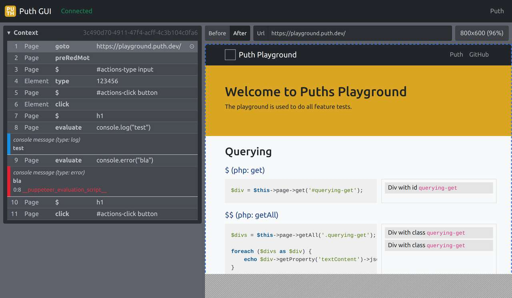

# Puth

[Puth](https://puth.dev) is a nice browser testing framework with focus on stability, performance and extensive feedback.



## Installing

```bash
npm i --save-dev puth
```

## Usage

To start a Puth Server
```bash
puth start
```

To start a Puth Server and instruct all Contexts to use a Daemon Browser
```bash
puth dev
```

To only run a Daemon
```bash
puth daemon
```

## Client

For client instruction, look at [Puth Javascript Client](https://puth.dev/docs/javascript)

## More information

For more information, visit [Puth Docs](https://puth.dev/docs/)