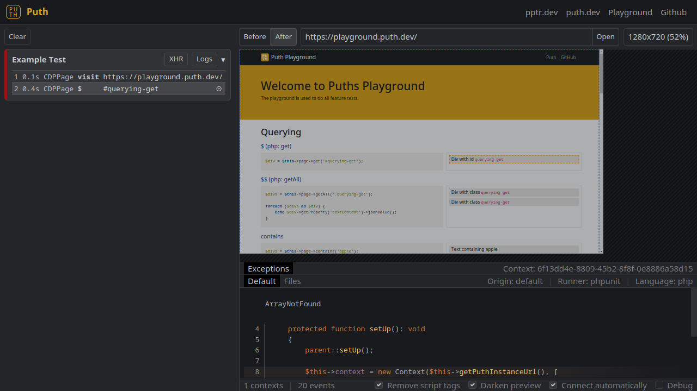

# Puth

[Puth](https://puth.dev) is a nice browser testing framework with focus on stability, performance and extensive
feedback. Currently supporting: JS, TS, PHP and Laravel (next up is Java (Spring)).

Current features are:

- Native Javascript and PHP clients (also Laravel integration)
- Snapshots which can be drag & dropped into the GUI
- Live GUI where you can see what happened before and after each command
- Also captures console log and network activity
- Client exceptions can be appended to a test
- Client logs can be appended
- Client files can be appended (e.g. environment/config files)
- See for yourself in the Screenshot, and yes, what you see can be exported if a test fails (or whenever you want to)
by your favourite CI/CD so you can simply drag it into you locally running GUI :)



## Important

Puth is a browser testing tool designed for development and CI/CD pipelines. Do **not** expose Puth to the public.
The problem is not Puppeteer/Chrome, but Puth allows calling **any** function that exists on the remote object.

## Usage

Using Puth with docker is recommended. Puth default port is `7345`.

### Docker

You can find Puth on [Dockerhub](https://hub.docker.com/r/seuh/puth). **Keep in mind**, if you run Puth in a Docker
container, you can't access localhost domains. If you e.g. use Vite then you need to start Puth with the
`--network host` flag and remove `-p 127.0.0.1:7345:7345` so that it can access e.g. `localhost:3000`.

```bash
docker run -it --rm -p 127.0.0.1:7345:7345 seuh/puth:0.6.4
```

### npm (not recommended)

You can install the `puth` npm package into your project but this is **not** recommended. If you can't use docker, i
recommend you install `puth` as a global package, but that might have some problems due to puppeteer not having enough
privilege to successfully install (you might have to sudo install).

```bash
npm install --global puth
puth start
```

## Clients

### Laravel

Puth has a Laravel integration package. You can find more information in [the package readme](workspaces/clients/php/laravel/README.md).

### PHP

Puth has a client package for PHP. You can find more information in [the package readme](workspaces/clients/php/client/README.md).


### JS/TS

Puth has a JS/TS client package currently bundled in `puth`. A standalone client package should be available soon.

You can find [the javascript client instructions here](https://puth.dev/docs/javascript).

## Known Bugs

### Subsequent keyboard down() calls ignore modifier keys

https://github.com/puppeteer/puppeteer/issues/9770