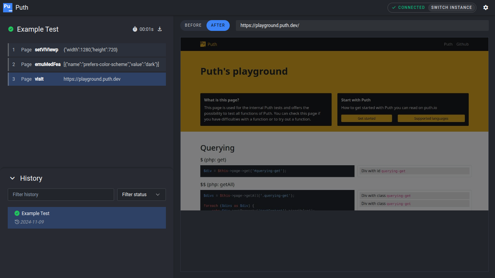

# Puth

[Puth](https://puth.io) is a nice browser testing framework with focus on stability, performance and extensive
feedback. Currently supported: PHP and Laravel.

Current features are:

- Native PHP client (with Laravel integration)
- Snapshots which can be drag & dropped into the GUI
- Realtime GUI where you can see what's happening before and after each command
- Captures console log
- See for yourself in the Screenshot. What you see can be exported if a test fails (or whenever you want to)
by your favourite CI/CD so when your tests fail you can simply drag the snapshot of the failed test into your locally running GUI

Known problems:
- The preview in the GUI is slightly delayed, the actual delay depends on what function is called and on system performance. The slower the system, the bigger the potential delay. The problem being that the browser always renders after the dom changes but Puth finishes the call when the "dom" is done, not when change is rendered.



## Important

Puth is a browser testing tool designed for development and CI/CD pipelines. Do **not** expose Puth to the internet, only run Puth with the least access needed.
The security risk with Puth has nothing to do with Puppeteer/Chrome, but with Puth allowing calling **any** function that exists on remote objects (basically every object in a Puth Context that can be accessed via the API).

## Usage

You can run Puth either via docker image or via npm package. Choose what fits best for your project/workflow.

### Docker

You can find Puth on [Dockerhub](https://hub.docker.com/r/puthio/puth). **Keep in mind**, if you run Puth in a Docker
container, you can't access the host network by default. If you e.g. use Vite then you need to start Puth with the
`--network host` flag and remove `-p 127.0.0.1:7345:7345` from the command below so that it can access Vite running on the host.

```bash
docker run -it --rm -p 127.0.0.1:7345:7345 puthio/puth:0.7.1
```

### npm

Install the `puth` npm package globally. On startup, it automatically downloads and caches the needed chrome installation either in your home directory or in the current working directory (don't worry it will prompt you so you can choose).

```bash
npm install --global puth
puth start
```

## Clients

### Laravel

Puth has a Laravel integration package. You can find more information in the [documentation](https://puth.io/docs/0_x/integrations/laravel).

### PHP

Puth has a client package for PHP. Currently undocumented.
